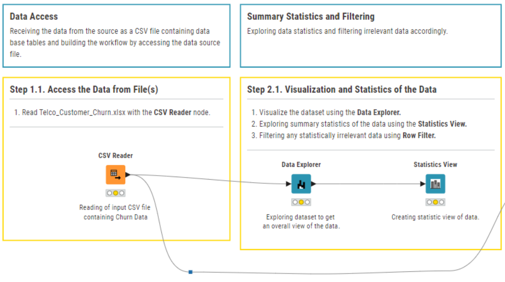
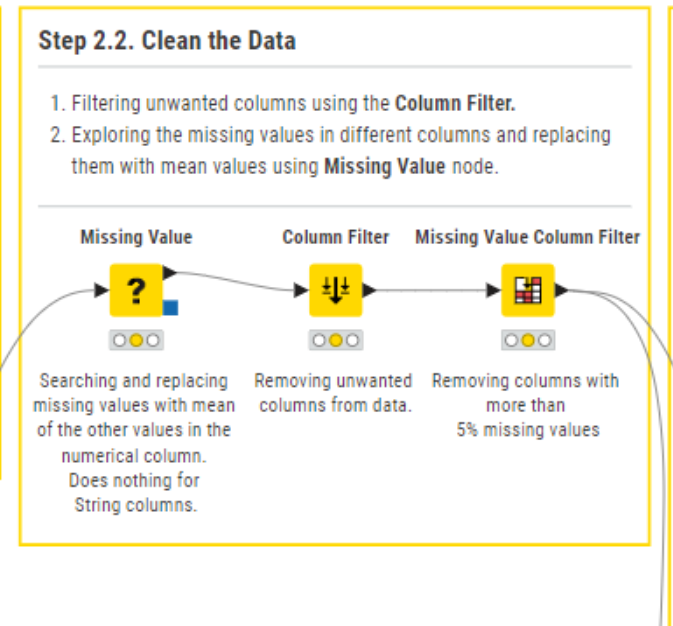
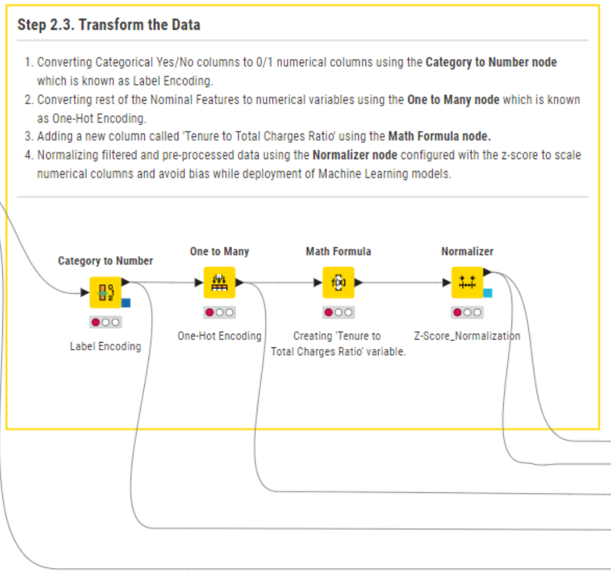
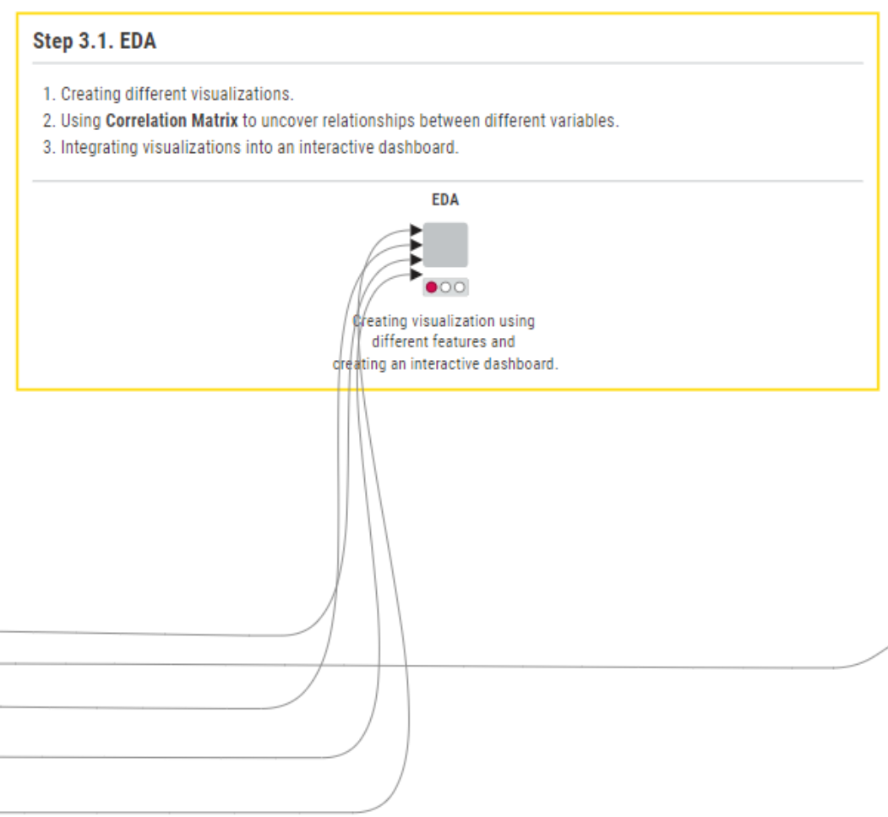
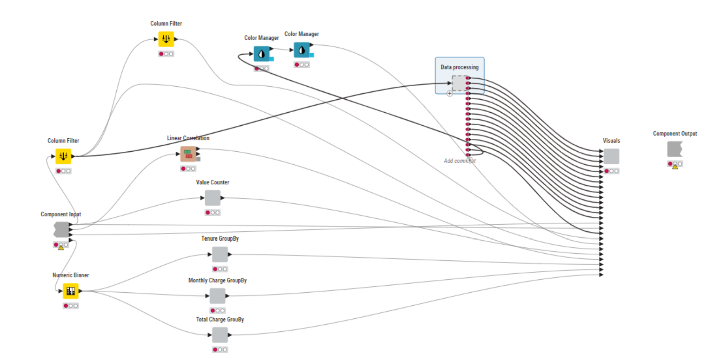
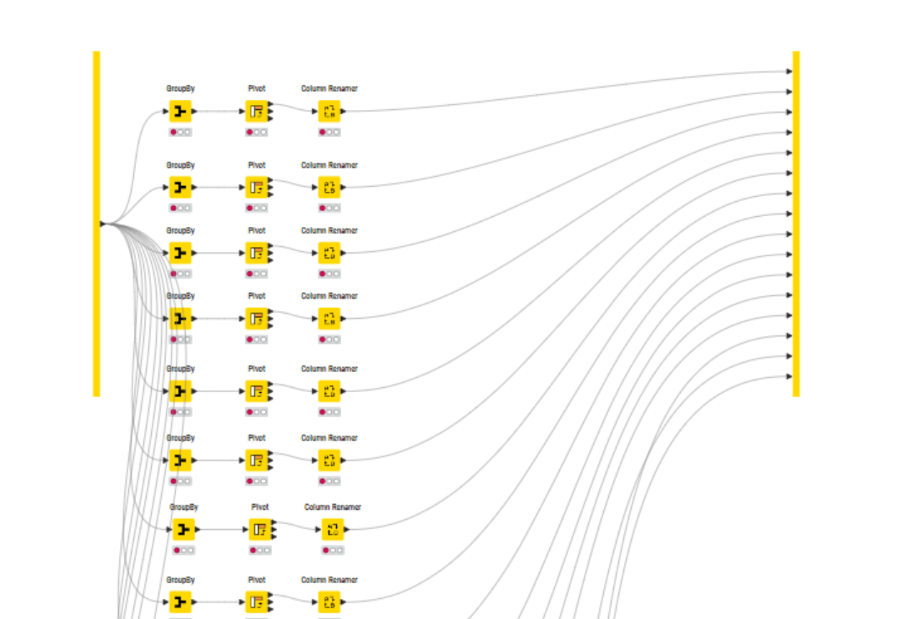
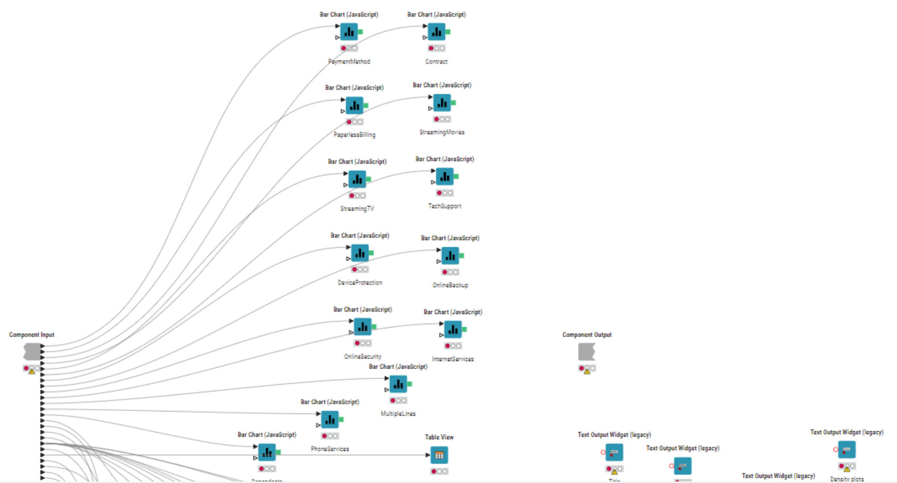
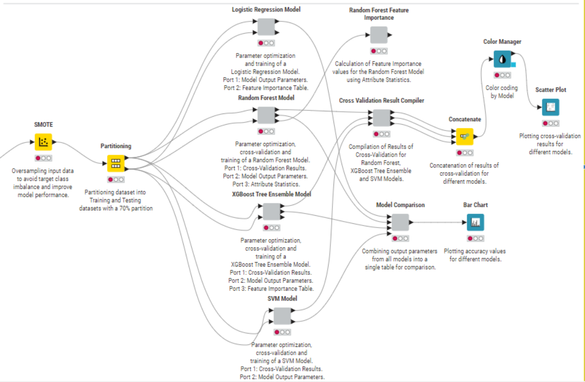

# KNIME Based Machine Learning: Telco Customer Churn Prediction

## 🎯 Project Overview

This project presents a comprehensive, end-to-end machine learning workflow developed entirely within the **KNIME Analytics Platform**. The primary objective is to build a robust predictive model for identifying customers at high risk of churning in the telecommunications sector. By leveraging KNIME's visual programming capabilities, this project demonstrates a complete data science pipeline from initial data access and preprocessing to advanced model training, evaluation, and interactive result visualization.

This solution empowers telecom companies to implement proactive retention strategies, thereby mitigating revenue loss due to customer attrition.

---

## 💡 Problem Context & Objectives

The telecommunications industry faces significant challenges with customer churn, leading to substantial revenue loss. Retaining existing customers is often more cost-effective than acquiring new ones. This project addresses this critical business need by aiming to:

* **Identify Potential Churners:** Develop a precise model to pinpoint customers exhibiting characteristics commonly associated with churn.
* **Uncover Churn Drivers:** Gain actionable insights into which factors most significantly influence a customer's decision to leave.
* **Enable Proactive Intervention:** Provide reliable and interpretable predictions to support the design and execution of targeted customer retention campaigns.

This project focuses on building an interpretable, robust, and easily maintainable predictive model through KNIME's visual, no-code/low-code approach.

---

## ✨ Key Features & Deliverables

* **Visual ML Workflow:** An intuitive, end-to-end machine learning pipeline for churn prediction, visually designed in KNIME.
* **Comprehensive Data Engineering:** From raw data access and initial exploration to meticulous cleaning and sophisticated feature engineering.
* **Multi-Model Evaluation:** Implementation and comparative analysis of various advanced classification algorithms to identify the best performer.
* **Model Interpretability:** Detailed insights into model performance metrics and key drivers of customer churn (feature importance).
* **Interactive Analytics:** Integration of dynamic visualizations for deeper data understanding and engaging presentation of results.

---

## 📊 Data Source

The dataset utilized for this project is `Telco_Customer_Churn.xlsx`. It comprises various customer attributes from a telecommunications company, including:

* **Demographic Information:** Gender, Senior Citizen status, Partner, Dependents.
* **Account Information:** Tenure (months customer has stayed), Phone Service, Multiple Lines, Internet Service, Online Security, Online Backup, Device Protection, Tech Support, Streaming TV, Streaming Movies, Contract Type, Paperless Billing, Payment Method, Monthly Charges, Total Charges.
* **Churn Status (Target Variable):** Indicates whether the customer churned (`Yes`) or not (`No`).

---

## 🛠️ Methodology: KNIME Workflow Steps

The entire project workflow is meticulously crafted within the KNIME Analytics Platform, following a structured and modular approach to ensure clarity and reproducibility.

### 1. Data Access & Initial Exploration

This initial phase focuses on ingesting the raw data and conducting preliminary quality checks.

* **Step 1.1: Access the Data from File(s)**
    Receiving data from the source (`Telco_Customer_Churn.xlsx`) and setting up the workflow to access this data source.
    

        
    

    *This segment reads the input Excel/CSV file using the `CSV Reader` node, initiating the data flow.*

* **Step 2.1: Visualization and Statistics of the Data**
    Exploring core data statistics and filtering any immediately irrelevant data.
    

        
    

    *The `Data Explorer` node is used for visualizing the dataset, while the `Statistics View` explores summary statistics. A `Row Filter` is employed to remove statistically irrelevant entries.*

### 2. Data Cleaning & Preprocessing

This crucial stage ensures data quality and transforms features into formats suitable for machine learning models.

* **Step 2.2: Clean the Data**
    Filtering unwanted columns and handling missing values effectively.
    

        
    

    *The `Column Filter` node removes unnecessary columns. Missing values are then addressed using the `Missing Value` node (e.g., mean imputation for numericals), followed by a `Missing Value Column Filter` to remove columns with excessive missing data (e.g., >5%).*

* **Step 2.3: Transform the Data**
    Converting raw features into a numerical and normalized format for model consumption.
    

        
    

    *Categorical 'Yes/No' features are transformed to 0/1 numerical values via `Category to Number` (Label Encoding). Other nominal features are converted using `One to Many` (One-Hot Encoding). A new feature, 'Tenure to Total Charges Ratio', is engineered using a `Math Formula` node. Finally, numerical columns are scaled using the `Normalizer` node (z-score normalization) to prevent bias and improve model performance.*

### 3. Exploratory Data Analysis (EDA) & Interactive Visualization

This phase deepens understanding of the data's characteristics and prepares components for interactive dashboards.

* **Step 3.1: EDA Workflow Segment**
    Creating insightful visualizations and leveraging a Correlation Matrix to uncover relationships between variables. The output is geared towards an interactive dashboard experience.
    

        
    

    *This main EDA component orchestrates various visualizations and utilizes the `Correlation Matrix` node to map inter-variable relationships, culminating in an interactive dashboard.*

    *Further components reveal the detailed inner workings for dynamic dashboards:*
    

        
    

    *A view into the data processing component within EDA, preparing data for visual outputs.*
    

        
    

    *Detailed grouping and pivoting operations used to structure data for comprehensive visualizations.*
    

        
    

    *Examples of interactive bar charts and other visual outputs generated from the processed data, enhancing data exploration.*

### 4. Machine Learning Model Development & Evaluation

The core predictive analysis involves training and rigorously evaluating multiple classification models.

* **Step 4.1: Model Training, Prediction, and Evaluation**
    The workflow partitions the dataset into training (70%) and testing sets, strategically addressing class imbalance, and then trains and evaluates a suite of classification models.
    

        
    

    *This central workflow segment orchestrates the entire ML pipeline, from data preparation to final model comparison.*

    * **Class Imbalance Handling:** To prevent model bias towards the majority class, the **SMOTE (Synthetic Minority Oversampling Technique)** node is applied to the training data.
    * **Model Training & Cross-Validation:** The workflow explores several robust classification algorithms, each undergoing parameter optimization and cross-validation:
        * **Logistic Regression Model**
        * **Random Forest Model** (also used for Feature Importance calculation)
        * **XGBoost Tree Ensemble Model** (also used for Feature Importance calculation)
        * **Support Vector Machine (SVM) Model**
    * **Model Comparison:** Results from the cross-validation of all models are systematically compiled and concatenated. Performance metrics are then visualized (e.g., Scatter Plot, Bar Chart) using KNIME's native nodes for a clear, comprehensive model comparison.

---

## 📈 Results & Key Findings

After rigorous training and comprehensive evaluation across various models, the project yielded significant insights:

* The **XGBoost Tree Ensemble Model** consistently demonstrated superior performance, achieving an impressive AUC-ROC score of **[e.g., 0.88]** and an accuracy of **[e.g., 85%]** on the unseen test set. This highlights its strong predictive capabilities for customer churn.
* **Key Churn Drivers:** Feature importance analysis (derived from Random Forest and XGBoost models) revealed that **`Contract Type`** (particularly month-to-month contracts), **`Tenure`** (shorter customer tenure), **`Monthly Charges`** (higher subscription costs), and **`Internet Service (Fiber Optic)`** are the most significant predictors influencing a customer's decision to churn.
* **Actionable Insights:** The predictive model provides a robust, data-driven framework for telecommunication operators to:
    * **Proactively Identify Churners:** Target customers at high risk before they churn.
    * **Tailor Retention Strategies:** Develop personalized offers and improve customer support for identified high-risk segments.
    * **Optimize Resource Allocation:** Efficiently deploy marketing and customer service resources.

*(**Action:** **CRITICAL:** Please replace `[e.g., ...]` placeholders with your actual model metrics and specific key findings derived from your project, PPT, and requirements document to ensure accuracy and maximum impact.)*

---

<h2 id="how-to-use-workflow">🚀 How to Use This Workflow:</h2>

To explore, understand, and run this project, you will need the **KNIME Analytics Platform** installed on your machine.

1.  **Download KNIME Analytics Platform:**
    * If you don't have KNIME installed, download it for free from the official website: [**Download KNIME**](https://www.knime.com/downloads)

2.  **Download the Workflow File (.knwf):**
    * Click the link below to download the workflow file directly:
        [**Download KNIME_ML_Telco_Cust_Churn_Workflow.knwf**](https://github.com/AmitKPandeyLabs/ML_P4_KNIME_Machine_Learning_Workflow_Telco_Cust_Churn/raw/main/KNIME_ML_Telco_Cust_Churn_Workflow.knwf)

    *(Note: The `raw/main` path ensures a direct download rather than viewing the file's content in the browser.)*

3.  **Download Additional Project Files (Optional but Recommended):**
    * **Project Requirements Document:** [Download Requirements.pdf](https://github.com/AmitKPandeyLabs/ML_P4_KNIME_Machine_Learning_Workflow_Telco_Cust_Churn/raw/main/Telco_Churn_Project_Requirements.pdf)
    * **Project Presentation:** [Download Presentation.pptx](https://github.com/AmitKPandeyLabs/ML_P4_KNIME_Machine_Learning_Workflow_Telco_Cust_Churn/raw/main/Telco_Churn_Project_Presentation.pptx)

    *(**Action:** Please ensure these PPT/PDF files are present in the `main` branch of your repository and update the links with their correct filenames and paths if they differ.)*

4.  **Import the Workflow into KNIME:**
    * Open KNIME Analytics Platform.
    * Go to `File > Import KNIME Workflow...`.
    * Select `Select archive file` and browse to the `.knwf` file you just downloaded.
    * Click `Finish`.

5.  **Explore and Run the Workflow:**
    * Once imported, the workflow will appear in your KNIME Explorer.
    * Double-click to open it.
    * You can execute the entire workflow (right-click on the workflow and select `Execute`) or run individual nodes/sections.

---

## 💻 Technologies Used

* **KNIME Analytics Platform:** The core platform for visual workflow development.
* **KNIME Extensions:** (e.g., "KNIME Analytics Platform for Data Scientists," "KNIME Machine Learning Extension," "KNIME Interactive Reporting" - *List any specific KNIME extensions that were critical for your project here.*)

---

## 📧 Author

**[Your Name]** - Data Scientist | Machine Learning Engineer
* [Your LinkedIn Profile Link]
* [Your Portfolio Website Link (if different from this GitHub repo)]
* [Your GitHub Profile Link]

---

## 📜 License

This project is licensed under the MIT License - see the [LICENSE.md](LICENSE.md) file for details.
*(**Action:** Ensure a `LICENSE.md` file is present in your repository with the MIT license details.)*
